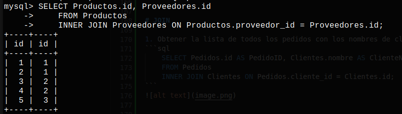

# tallerSQL
Normalización
1. Crear una tabla HistorialPedidos que almacene cambios en los pedidos.

```sql 
   CREATE TABLE HistorialPedidos(
    id INT PRIMARY KEY AUTO_INCREMENT,
    fecha_modificacion TIMESTAMP,
    pedido_id INT,
    cantidad_salida INT,
    cantidad_entrada INT,
    FOREIGN KEY (pedido_id) REFERENCES Pedidos(id)
);
```

2. Evaluar la tabla Clientes para eliminar datos redundantes y normalizar hasta 3NF.ç
```sql 
    CREATE TABLE Clientes (
    id INT PRIMARY KEY AUTO_INCREMENT,
    nombre VARCHAR(100)
    );
   CREATE TABLE Email(
    id INT PRIMARY KEY AUTO_INCREMENT,
    cliente_id INT,
    email VARCHAR(50),
    FOREIGN KEY (cliente_id) REFERENCES Clientes(id)
    );
```
3. Separar la tabla Empleados en una tabla de DatosEmpleados y otra para Puestos .
```sql

    CREATE TABLE puestos(
        id INT PRIMARY KEY AUTO_INCREMENT,
        nombre VARCHAR (50)
    );
    CREATE TABLE DatosEmpleados(
     id INT PRIMARY KEY AUTO_INCREMENT,
     nombre VARCHAR(100),
     puesto_id INT,
     salario FLOAT(10,2),
     fecha_contratacion DATE,
     FOREIGN KEY (puesto_id) REFERENCES puestos(id)
);
```
4. Revisar la relación Clientes y UbicacionCliente para evitar duplicación de datos.
```sql    
    CREATE TABLE UbicacionCliente (
        id INT PRIMARY KEY AUTO_INCREMENT,
        cliente_id INT UNIQUE,
        direccion VARCHAR(255),
        ciudad_id INT,
        FOREIGN KEY (cliente_id) REFERENCES Clientes(id),
        FOREIGN KEY (ciudad_id) REFERENCES Ciudades(id)
    );
    CREATE TABLE Paises (
        id INT PRIMARY KEY AUTO_INCREMENT,
        nombre VARCHAR(50) UNIQUE
    );

    CREATE TABLE Estados (
        id INT PRIMARY KEY AUTO_INCREMENT,
        nombre VARCHAR(50),
        pais_id INT,
        FOREIGN KEY (pais_id) REFERENCES Paises(id)
    );

    CREATE TABLE Ciudades (
        id INT PRIMARY KEY AUTO_INCREMENT,
        nombre VARCHAR(100),
        estado_id INT,
        codigo_postal VARCHAR(10),
        FOREIGN KEY (estado_id) REFERENCES Estados(id)
    );
``` 
5. Normalizar Proveedores para tener ContactoProveedores en otra tabla.
```sql
    CREATE TABLE ContactoProveedores(
        id INT PRIMARY KEY AUTO_INCREMENT,
        proveedor_id INT,
        contacto VARCHAR(100),
        telefono VARCHAR(20),
        direccion VARCHAR(255),
        FOREIGN KEY (proveedor_id) REFERENCES Proveedores(id)
    );

```
6. Crear una tabla de Telefonos para almacenar múltiples números por cliente.
```sql
    --Tabla TipoTelefono
    CREATE TABLE  TipoTelefono( 
        id INT PRIMARY KEY AUTO_INCREMENT,
        nombre VARCHAR (20)
    )

    --Tabla TelefonosCliente
    CREATE TABLE TelefonosCliente(
        id INT PRIMARY KEY AUTO_INCREMENT,
        cliente_id INT,
        numero_tel VARCHAR(15),
        tipo_id INT,
        FOREIGN KEY (tipo_id) REFERENCES TipoTelefono(id),
        FOREIGN KEY (cliente_id) REFERENCES Clientes(id)
    )
```
7. Transformar TiposProductos en una relación categórica jerárquica.
```sql
    CREATE TABLE CategoriasProductos (
        id INT PRIMARY KEY AUTO_INCREMENT,
        nombre VARCHAR(100) NOT NULL,
        descripcion TEXT,
        padre_id INT NULL,
        nivel INT DEFAULT 1,
        FOREIGN KEY (padre_id) REFERENCES CategoriasProductos(id)
    );
```
8. Normalizar Pedidos y DetallesPedido para evitar inconsistencias de precios.
```sql

    CREATE TABLE Pedidos (
        id INT PRIMARY KEY AUTO_INCREMENT,
        cliente_id INT,
        producto_id INT,
        fecha DATE,
        precio DECIMAL(10, 2),
        FOREIGN KEY (cliente_id) REFERENCES Clientes(id),
        FOREIGN KEY (producto_id) REFERENCES Productos(id)
    );

 
    CREATE TABLE DetallesPedido (
        id INT PRIMARY KEY AUTO_INCREMENT,
        pedido_id INT,
        producto_id INT,
        precio DECIMAL(10, 2),
        FOREIGN KEY (pedido_id) REFERENCES Pedidos(id),
        FOREIGN KEY (producto_id) REFERENCES Productos(id)
    );
```
9. Usar una relación de muchos a muchos para Empleados y Proveedores .

```sql
            CREATE TABLE EmpleadosProveedores(
                id INT PRIMARY KEY AUTO_INCREMENT,
                empleados_id INT,
                proveedores_id INT,
                FOREIGN KEY (empleados_id) REFERENCES Empleados(id),
                FOREIGN KEY (proveedores_id) REFERENCES Proveedores(id)
            )
```


10. Convertir la tabla UbicacionCliente en una relación genérica de Ubicaciones .
```sql    
    CREATE TABLE Entidad(
        id INT PRIMARY KEY AUTO_INCREMENT,
        nombre VARCHAR (50)
    )
    CREATE TABLE Ubicaciones(
        id INT PRIMARY KEY AUTO_INCREMENT,
        entidad_id INT UNIQUE,
        direccion VARCHAR(255),
        ciudad_id INT,
        FOREIGN KEY (cliente_id) REFERENCES Entidad(id),
        FOREIGN KEY (ciudad_id) REFERENCES Ciudades(id)
    );
``` 

# JOIN

1. Obtener la lista de todos los pedidos con los nombres de clientes usando INNER JOIN .
```sql
    SELECT Pedidos.id AS PedidoID, Clientes.nombre AS ClienteNombre
    FROM Pedidos
    INNER JOIN Clientes ON Pedidos.cliente_id = Clientes.id;
```


2. Listar los productos y proveedores que los suministran con INNER JOIN .
```sql
    SELECT Productos.id, Proveedores.id
    FROM Productos
    INNER JOIN Proveedores ON Productos.proveedor_id = Proveedores.id;
```



3. Mostrar los pedidos y las ubicaciones de los clientes con LEFT JOIN .
```sql
    SELECT Pedidos.id AS PedidoID, Ubicaciones.direccion AS Direccion
    FROM Pedidos
    LEFT JOIN Ubicaciones ON Pedidos.cliente_id = Ubicaciones.id;
```


4. Consultar los empleados que han registrado pedidos, incluyendo empleados sin pedidos
( LEFT JOIN ).
```sql
    SELECT DatosEmpleados.nombre AS EmpleadoNombre, Pedidos.id AS PedidoID
    FROM DatosEmpleados
    LEFT JOIN Pedidos ON DatosEmpleados.id = Pedidos.cliente_id;
```


5. Obtener el tipo de producto y los productos asociados con INNER JOIN .
```sql
    SELECT TiposProductos.tipo_nombre AS TipoProducto, Productos.nombre AS Producto
    FROM TiposProductos
    INNER JOIN Productos ON TiposProductos.id = Productos.tipo_id;
```


6. Listar todos los clientes y el número de pedidos realizados con COUNT y GROUP BY .
```sql
    SELECT Clientes.nombre AS ClienteNombre, COUNT(Pedidos.id) AS NumeroPedidos
    FROM Clientes
    INNER JOIN Pedidos ON Clientes.id = Pedidos.cliente_id
    GROUP BY Clientes.nombre;
```


7. Combinar Pedidos y Empleados para mostrar qué empleados gestionaron pedidos
específicos.
```sql
    SELECT Pedidos.id AS PedidoID, DatosEmpleados.nombre AS EmpleadoNombre
    FROM Pedidos
    INNER JOIN DatosEmpleados ON Pedidos.cliente_id = DatosEmpleados.id;
```


8. Mostrar productos que no han sido pedidos ( RIGHT JOIN ).
```sql
    SELECT Productos.nombre AS Producto, Pedidos.id AS PedidoID
    FROM Pedidos
    RIGHT JOIN Productos ON Pedidos.producto_id = Productos.id
    WHERE Pedidos.id IS NULL;
```


9. Mostrar el total de pedidos y ubicación de clientes usando múltiples JOIN .
```sql
SELECT COUNT(Pedidos.id) AS TotalPedidos, Ubicaciones.direccion AS Direccion
FROM Pedidos
INNER JOIN Clientes ON Pedidos.cliente_id = Clientes.id
INNER JOIN Ubicaciones ON Clientes.id = Ubicaciones.entidad_id
GROUP BY Ubicaciones.direccion;
```


10. Unir Proveedores , Productos , y TiposProductos para un listado completo de inventario
```sql
SELECT Proveedores.nombre AS Proveedor, Productos.nombre AS Producto, TiposProductos.tipo_nombre AS TipoProducto
FROM Proveedores
INNER JOIN Productos ON Proveedores.id = Productos.proveedor_id
INNER JOIN TiposProductos ON Productos.tipo_id = TiposProductos.id;
```


#CONSULTAS SIMPLES

1. Seleccionar todos los productos con precio mayor a $50.
```sql
    SELECT id, nombre, precio FROM Productos
    WHERE precio > 50;
```


2. Consultar clientes registrados en una ciudad específica.
```sql    
    SELECT cliente_id FROM UbicacionCliente
    WHERE ciudad_id = 1;
```


3. Mostrar empleados contratados en los últimos 2 años.
```sql 
    SELECT nombre FROM DatosEmpleados
    WHERE fecha_contratacion >= '2023-01-01';
```


4. Seleccionar proveedores que suministran más de 5 productos.
```sql
    SELECT Proveedores.nombre, COUNT(Productos.id) AS ProductosSuministrados
    FROM Proveedores
    INNER JOIN Productos ON Proveedores.id = Productos.proveedor_id
    GROUP BY Proveedores.nombre
    HAVING COUNT(Productos.id) > 5;
```

5. Listar clientes que no tienen dirección registrada en UbicacionCliente .
```sql
    SELECT Clientes.nombre
    FROM Clientes
    LEFT JOIN UbicacionCliente ON Clientes.id = UbicacionCliente.cliente_id
    WHERE UbicacionCliente.cliente_id IS NULL;
```


6. Calcular el total de ventas por cada cliente.
```sql
    SELECT Clientes.nombre, SUM(Pedidos.precio) AS TotalVentas
    FROM Clientes
    INNER JOIN Pedidos ON Clientes.id = Pedidos.cliente_id
    GROUP BY Clientes.nombre;
```

7. Mostrar el salario promedio de los empleados.
```sql
    SELECT AVG(salario) AS SalarioPromedio
    FROM DatosEmpleados;
```


8. Consultar el tipo de productos disponibles en TiposProductos .
```sql
    SELECT tipo_nombre FROM TiposProductos;
```


9. Seleccionar los 3 productos más caros.
```sql
    SELECT nombre, precio FROM Productos
    ORDER BY precio DESC
    LIMIT 3;
```


10. Consultar el cliente con el mayor número de pedidos.
```sql
    SELECT Clientes.nombre, COUNT(Pedidos.id) AS NumeroPedidos
    FROM Clientes
    INNER JOIN Pedidos ON Clientes.id = Pedidos.cliente_id
    GROUP BY Clientes.nombre
    ORDER BY COUNT(Pedidos.id) DESC
    LIMIT 1;
```


# 4. Consultas Multitabla

1. Listar todos los pedidos y el cliente asociado
```sql
    SELECT Pedidos.id AS PedidoID, Clientes.nombre AS Cliente
    FROM Pedidos
    INNER JOIN Clientes ON Pedidos.cliente_id = Clientes.id;
```


2. Mostrar la ubicación de cada cliente en sus pedidos.
```sql
    SELECT Clientes.nombre AS Cliente, Ubicaciones.direccion AS Ubicacion
    FROM Pedidos
    INNER JOIN Clientes ON Pedidos.cliente_id = Clientes.id
    INNER JOIN Ubicaciones ON Clientes.id = Ubicaciones.entidad_id;
```
3. Listar productos junto con el proveedor y tipo de producto.
```sql
    SELECT Productos.nombre AS Producto, Proveedores.nombre AS Proveedor, TiposProductos.tipo_nombre AS Tipo
    FROM Productos
    INNER JOIN Proveedores ON Productos.proveedor_id = Proveedores.id
    INNER JOIN TiposProductos ON Productos.tipo_id = TiposProductos.id;
```
4. Consultar todos los empleados que gestionan pedidos de clientes en una ciudad específica.
```sql
    SELECT DatosEmpleados.nombre AS Empleado
    FROM DatosEmpleados
    INNER JOIN Pedidos ON DatosEmpleados.id = Pedidos.cliente_id
    INNER JOIN Clientes ON Pedidos.cliente_id = Clientes.id
    INNER JOIN Ubicaciones ON Clientes.id = Ubicaciones.entidad_id
    INNER JOIN Ciudades ON Ubicaciones.ciudad_id = Ciudades.id
    WHERE Ciudades.nombre = 'CiudadEspecifica';

```

5. Consultar los 5 productos más vendidos.
```sql
    SELECT Productos.nombre AS Producto, COUNT(DetallesPedido.id) AS TotalVendido
    FROM DetallesPedido
    INNER JOIN Productos ON DetallesPedido.producto_id = Productos.id
    GROUP BY Productos.id
    ORDER BY TotalVendido DESC
    LIMIT 5;
```
6. Obtener la cantidad total de pedidos por cliente y ciudad.
```sql 
    SELECT Clientes.nombre AS Cliente, Ciudades.nombre AS Ciudad, COUNT(Pedidos.id) AS TotalPedidos
    FROM Pedidos
    INNER JOIN Clientes ON Pedidos.cliente_id = Clientes.id
    INNER JOIN Ubicaciones ON Clientes.id = Ubicaciones.entidad_id
    INNER JOIN Ciudades ON Ubicaciones.ciudad_id = Ciudades.id
    GROUP BY Clientes.id, Ciudades.id;
```
7. Listar clientes y proveedores en la misma ciudad.
```sql
    SELECT Clientes.nombre AS Cliente, Proveedores.nombre AS Proveedor, Ciudades.nombre AS Ciudad
    FROM Clientes
    INNER JOIN Ubicaciones ON Clientes.id = Ubicaciones.entidad_id
    INNER JOIN Ciudades ON Ubicaciones.ciudad_id = Ciudades.id
    INNER JOIN Proveedores ON Proveedores.id = Productos.proveedor_id
    INNER JOIN Productos ON Productos.proveedor_id = Proveedores.id
    WHERE Ciudades.nombre = 'CiudadEspecifica';
```
8. Mostrar el total de ventas agrupado por tipo de producto.
```sql
    SELECT TiposProductos.tipo_nombre AS TipoProducto, SUM(DetallesPedido.precio) AS TotalVentas
    FROM DetallesPedido
    INNER JOIN Productos ON DetallesPedido.producto_id = Productos.id
    INNER JOIN TiposProductos ON Productos.tipo_id = TiposProductos.id
    GROUP BY TiposProductos.tipo_nombre;
```
9. Listar empleados que gestionan pedidos de productos de un proveedor específico.
```sql
    SELECT DISTINCT DatosEmpleados.nombre AS Empleado
    FROM DatosEmpleados
    INNER JOIN Pedidos ON DatosEmpleados.id = Pedidos.cliente_id
    INNER JOIN Productos ON Pedidos.producto_id = Productos.id
    WHERE Productos.proveedor_id = 'ProveedorID';
```
10. Obtener el ingreso total de cada proveedor a partir de los productos vendidos.
```sql
    SELECT Proveedores.nombre AS Proveedor, SUM(DetallesPedido.precio) AS IngresoTotal
    FROM DetallesPedido
    INNER JOIN Productos ON DetallesPedido.producto_id = Productos.id
    INNER JOIN Proveedores ON Productos.proveedor_id = Proveedores.id
    GROUP BY Proveedores.nombre;
```

# Subconsultas
1. Consultar el producto más caro en cada categoría
sql
```sql
SELECT tipo_nombre, nombre, precio
FROM Productos
WHERE precio = (SELECT MAX(precio) FROM Productos WHERE tipo_id = Productos.tipo_id);
```
2. Encontrar el cliente con mayor total en pedidos
sql
```sql
SELECT Clientes.nombre, SUM(Pedidos.precio) AS TotalPedidos
FROM Clientes
INNER JOIN Pedidos ON Clientes.id = Pedidos.cliente_id
GROUP BY Clientes.id
ORDER BY TotalPedidos DESC
LIMIT 1;
```
3. Listar empleados que ganan más que el salario promedio
sql
```sql
SELECT nombre, salario
FROM DatosEmpleados
WHERE salario > (SELECT AVG(salario) FROM DatosEmpleados);
```
4. Consultar productos que han sido pedidos más de 5 veces
sql
```sql
SELECT Productos.nombre
FROM DetallesPedido
INNER JOIN Productos ON DetallesPedido.producto_id = Productos.id
GROUP BY Productos.id
HAVING COUNT(DetallesPedido.id) > 5;
```
5. Listar pedidos cuyo total es mayor al promedio de todos los pedidos
sql
```sql
SELECT id, precio
FROM Pedidos
WHERE precio > (SELECT AVG(precio) FROM Pedidos);
```
6. Seleccionar los 3 proveedores con más productos
sql
```sql
SELECT Proveedores.nombre, COUNT(Productos.id) AS TotalProductos
FROM Proveedores
INNER JOIN Productos ON Proveedores.id = Productos.proveedor_id
GROUP BY Proveedores.id
ORDER BY TotalProductos DESC
LIMIT 3;
```
7. Consultar productos con precio superior al promedio en su tipo
sql
```sql
SELECT Productos.nombre, Productos.precio
FROM Productos
WHERE Productos.precio > (SELECT AVG(precio) FROM Productos WHERE tipo_id = Productos.tipo_id);
```
8. Mostrar clientes que han realizado más pedidos que la media
sql
```sql
SELECT Clientes.nombre
FROM Clientes
INNER JOIN Pedidos ON Clientes.id = Pedidos.cliente_id
GROUP BY Clientes.id
HAVING COUNT(Pedidos.id) > (SELECT AVG(pedido_count) FROM (SELECT COUNT(id) AS pedido_count FROM Pedidos GROUP BY cliente_id) AS PedidoCount);
```
9. Encontrar productos cuyo precio es mayor que el promedio de todos los productos
sql
```sql
SELECT nombre, precio
FROM Productos
WHERE precio > (SELECT AVG(precio) FROM Productos);
```
10. Mostrar empleados cuyo salario es menor al promedio del departamento
sql
```sql
SELECT nombre, salario
FROM DatosEmpleados
WHERE salario < (SELECT AVG(salario) FROM DatosEmpleados WHERE puesto_id = DatosEmpleados.puesto_id);
```
# Procedimientos Almacenados
1. Crear un procedimiento para actualizar el precio de todos los productos de un proveedor
sql
```sql
DELIMITER //
CREATE PROCEDURE actualizar_precio_proveedor(IN proveedor_id INT, IN nuevo_precio DECIMAL(10,2))
BEGIN
    UPDATE Productos SET precio = nuevo_precio WHERE proveedor_id = proveedor_id;
END //
DELIMITER ;
```
2. Un procedimiento que devuelva la dirección de un cliente por ID
sql
```sql
    DELIMITER //
    CREATE PROCEDURE obtener_direccion_cliente(IN cliente_id INT)
    BEGIN
        SELECT Ubicaciones.direccion
        FROM Ubicaciones
        INNER JOIN Entidad ON Ubicaciones.entidad_id = Entidad.id
        WHERE Entidad.id = cliente_id;
    END //
    DELIMITER ;
```
3. Crear un procedimiento que registre un pedido nuevo y sus detalles
sql
```sql
DELIMITER //
CREATE PROCEDURE registrar_pedido(IN cliente_id INT, IN producto_id INT, IN precio DECIMAL(10,2), IN fecha DATE)
BEGIN
    INSERT INTO Pedidos(cliente_id, producto_id, precio, fecha) VALUES (cliente_id, producto_id, precio, fecha);
    SET @ultimo_pedido_id = LAST_INSERT_ID();
    INSERT INTO DetallesPedido(pedido_id, producto_id, precio) VALUES (@ultimo_pedido_id, producto_id, precio);
END //
DELIMITER ;
```